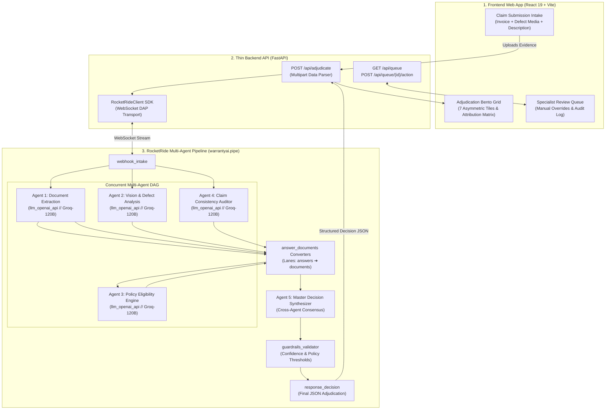

# 🛡️ WarrantyAI — Multi-Agent Claim Adjudication Engine

> **Autonomous, evidence-based warranty decision tooling powered by RocketRide DAP and Groq LLaMA-120B.**

---

## 📖 Table of Contents
1. [Project Overview & Core Mission](#-project-overview--core-mission)
2. [The Golden Rule: Zero Mock Data](#-the-golden-rule-zero-mock-data)
3. [System Architecture Diagram](#-system-architecture-diagram)
4. [Deep-Dive: The Multi-Agent Pipeline (`warrantyai.pipe`)](#-deep-dive-the-multi-agent-pipeline-warrantyaipipe)
   - [How RocketRide DAGs Work](#how-rocketride-dags-work)
   - [The 5 Specialist Agents](#the-5-specialist-agents)
   - [Data Converters & Typed Lanes](#data-converters--typed-lanes)
5. [Backend API Architecture (`backend/main.py`)](#-backend-api-architecture-backendmainpy)
6. [Frontend UI & Bento Grid System (`frontend/`)](#-frontend-ui--bento-grid-system-frontend)
   - [The 12-Column Bento Grid Layout](#the-12-column-bento-grid-layout)
   - [Signature Element: Evidence Attribution Matrix](#signature-element-evidence-attribution-matrix)
   - [Human Review Queue](#human-review-queue)
7. [Step-by-Step Setup & Installation Guide](#-step-by-step-setup--installation-guide)
8. [Real-World Walkthrough: The Evidson X55i Claim](#-real-world-walkthrough-the-evidson-x55i-claim)
9. [Project Directory Tree](#-project-directory-tree)

---

## 🎯 Project Overview & Core Mission

**WarrantyAI** is an enterprise-grade, evidence-based decision-support system designed for warranty operations managers, fraud auditors, and customer experience teams. 

Instead of routing claims through a single generic LLM prompt, WarrantyAI executes a **Directed Acyclic Graph (DAG) of 5 specialized AI agents** running concurrently on the **RocketRide Distributed Agent Platform (DAP)**. Each agent is a specialist in one domain:
1. Extracting and validating tax receipts/invoices.
2. Inspecting high-resolution damage photos for physical trauma and fraud.
3. Calculating warranty date math and return policy eligibility.
4. Auditing customer statements for consistency against physical evidence.
5. Synthesizing all findings into an auditable adjudication outcome with confidence scores and risk flags.

---

## 🚨 The Golden Rule: Zero Mock Data

This repository strictly enforces the **Real Data Only** standard documented in [`AGENTS.md`](AGENTS.md):
* **No Simulated Decisions:** The pipeline never fabricates, mocks, or hardcodes decisions. Every run connects directly to the live RocketRide DAP server and invokes real Groq LLM inference.
* **Fail Loudly & Explicitly:** If an API key is missing, revoked, or if a network disconnect occurs, the engine exits immediately with error code `1` and prints a clear error explanation. It will **never** fall back to fake synthetic data.

---

## 🏛️ System Architecture Diagram



---

## 🔬 Deep-Dive: The Multi-Agent Pipeline (`warrantyai.pipe`)

### How RocketRide DAGs Work
In RocketRide, a pipeline is defined as a Directed Acyclic Graph (DAG) in JSON format. Every node is a **component** that receives data on specific input **lanes**, performs a transformation, and outputs data on output lanes.

### The 5 Specialist Agents

| Agent ID | Provider | Role & Responsibilities |
| :--- | :--- | :--- |
| **`llm_document_agent`** | `llm_openai_api` (Groq) | **Document Extraction Specialist:** Reads the purchase invoice/bill. Extracts store name, customer name, purchase date, item model number, price, and checks for document alteration/tampering flags. |
| **`llm_vision_agent`** | `llm_openai_api` (Groq) | **Visual Damage Specialist:** Inspects damage images. Evaluates damage visibility, identifies fracture points, assigns a **Severity Score (1–10)**, classifies root cause (Manufacturing Defect vs. Accidental Physical Trauma), and verifies image authenticity. |
| **`llm_warranty_check`** | `llm_openai_api` (Groq) | **Policy Eligibility Engine:** Performs strict date math. Calculates exact days elapsed from invoice purchase date to the claim date, evaluates standard manufacturer warranty terms (e.g. 6/12 months), and checks retail return windows. |
| **`llm_claim_agent`** | `llm_openai_api` (Groq) | **Consistency Auditor:** Compares the customer's text description against the visual damage and invoice. Flags discrepancies, tone, and claim category. |
| **`llm_decision_agent`** | `llm_openai_api` (Groq) | **Master Decision Synthesizer:** Aggregates findings from all 4 upstream specialists. Computes overall confidence score, selects the dispatch route (`auto`, `verify`, or `human_review`), and recommends the action (`repair`, `replace`, `refund`, or `deny`). |

### Data Converters & Typed Lanes
RocketRide enforces strict lane types:
* `webhook_intake` emits `text` data.
* `question` nodes transform incoming `text` into `questions`.
* `prompt` nodes inject detailed system instructions, guidelines, and context into `questions`.
* `llm_openai_api` processes `questions` and emits `answers`.
* `answer_documents` converters parse LLM JSON `answers` and package them into structured `documents`.
* `prompt_decision_agent` gathers all upstream `documents` simultaneously before triggering the final decision agent.

---

## ⚡ Backend API Architecture (`backend/main.py`)

The backend is a thin, high-performance **FastAPI** service that bridges the web client with the RocketRide DAP WebSocket server:

* **`POST /api/adjudicate`**:
  * Accepts multipart form data (invoice file, damage image, customer description, or `use_sample` flag).
  * Loads `warrantyai.pipe`, substitutes environment variables (`${ROCKETRIDE_GROQ_KEY}`), and connects via `RocketRideClient`.
  * Sends the payload to `webhook_intake` and awaits multi-agent DAG completion.
  * Normalizes the raw LLM output into a clean JSON contract consumed by the React Bento Grid.
* **`GET /api/queue`**: Returns claims routed to secondary verification or human specialist review.
* **`POST /api/queue/{claim_id}/action`**: Allows warranty specialists to approve or override decisions.
* **`GET /api/health`**: Real-time health check endpoint verifying engine readiness.

---

## 🎨 Frontend UI & Bento Grid System (`frontend/`)

Built with **React 19** and **Vite**, the interface avoids generic AI-tool cliches (no warm-cream/terracotta palettes, no neon-on-black, no floating decorative blobs) in favor of a **grounded, evidence-based operations dashboard**.

### The 12-Column Bento Grid Layout

```
┌─────────────────────────────────────┬────────────────────────────────────────────────────────┐
│ Tile 1: Decision Hero (5 cols)      │ Tile 2: Evidence Attribution Matrix (7 cols)           │
│ - Major Action (REPAIR / DENY)      │ - Breakdown of agent factor weights summing to 100%    │
│ - Route Pill (AUTO / HUMAN REVIEW)  │ - Confidence contributions per specialist agent        │
│ - Overall Confidence Score (99%)    │                                                        │
├───────────────────┬─────────────────┴───┬────────────────────────────────────────────────────┤
│ Tile 3: Document  │ Tile 4: Visual      │ Tile 5: Policy Date Math                           │
│ Extraction (4 col)│ Damage (4 col)      │ & Eligibility (4 col)                              │
│ - Invoice details │ - Defect category   │ - Purchase date vs. standard cutoff                │
│ - Serial & Retail │ - Severity (1-10)   │ - Days elapsed & active/expired status             │
├───────────────────┴─────────────────────┴───┬────────────────────────────────────────────────┤
│ Tile 6: Full Adjudication Explanation (8 col)│ Tile 7: Risk & Fraud Audit Flags (4 col)       │
│ - Auditable 2-4 sentence rationale citing    │ - High-visibility flags (e.g. crushing damage, │
│   all upstream specialist findings           │   warranty expired, sheared wiring)            │
└──────────────────────────────────────────────┴────────────────────────────────────────────────┘
```

### Signature Element: Evidence Attribution Matrix
Instead of a generic circular progress bar, Tile 2 presents a **fintech-style attribution ledger**. It explicitly shows how much percentage weight each factor contributed to the final outcome:
* **Warranty Expiry Window (50% weight):** High Negative Impact
* **Visual Damage Trauma (35% weight):** High Negative Impact
* **Document Extraction Authenticity (10% weight):** Positive Impact
* **Customer Statement Alignment (5% weight):** Neutral Impact

### Human Review Queue
A scannable working queue for warranty auditors to review flagged edge-cases with quick `Approve` and `Deny` override buttons.

---

## 🚀 Step-by-Step Setup & Installation Guide

### Prerequisites
* **Python 3.10+**
* **Node.js 18+** & **npm**
* RocketRide Account & API Key ([RocketRide AI](https://rocketride.ai))
* Groq API Key ([Groq Console](https://console.groq.com))

---

### 1. Clone Repository & Setup Virtual Environment
```bash
# Clone the repository
git clone https://github.com/Krishna-Techstar/WarrantyAI.git
cd WarrantyAI

# Create and activate Python virtual environment
python -m venv .venv

# On Windows (PowerShell):
.venv\Scripts\Activate.ps1

# On macOS/Linux:
source .venv/bin/activate
```

---

### 2. Install Dependencies
```bash
# Install Python backend packages
pip install rocketride fastapi uvicorn python-multipart requests

# Install Frontend packages
cd frontend
npm install
cd ..
```

---

### 3. Configure Environment Variables
Create a `.env` file in the project root based on `env.example`:
```ini
# RocketRide Core Configuration
ROCKETRIDE_URI=https://staging.rocketride.ai
ROCKETRIDE_APIKEY=rr_your_rocketride_api_key_here

# LLM Providers (Groq)
ROCKETRIDE_GROQ_KEY=gsk_your_groq_api_key_here
```

---

### 4. Run the Application

#### Terminal 1 — Start Backend Server:
```powershell
.venv\Scripts\python.exe -m uvicorn backend.main:app --host 127.0.0.1 --port 8000 --reload
```

#### Terminal 2 — Start Frontend Server:
```powershell
cd frontend
npm run dev -- --host 127.0.0.1 --port 5173
```

#### Open the Dashboard:
Visit **[http://127.0.0.1:5173/](http://127.0.0.1:5173/)** in your web browser.

---

### 5. Run Standalone CLI Pipeline Test
You can also run the pipeline directly in your terminal without the UI:
```powershell
python test_real_claim.py
```

---

## 🔎 Real-World Walkthrough: The Evidson X55i Claim

The repository includes real sample assets in `samples/`:
1. **Invoice (`samples/sample_bill.png`):** Amazon tax invoice for *Evidson Audio X55i in-Ear Earphones with Mic (Black)*, purchased **06-Oct-2018** for **₹549 INR**.
2. **Defect Photo (`samples/sample_damage.png`):** Photo showing shattered earbud housing with internal driver wiring exposed and cable torn near the 3.5mm jack.
3. **Customer Statement:** *"bill defected product issue is the earphone is broken from earplugs"*

### Pipeline Adjudication Result:
* **Recommended Action:** **`POLICY DENIAL`** (Auto-Closed)
* **Overall Confidence:** **`99%`**
* **Findings:**
  1. *Warranty Expired:* The standard 6-month warranty expired on **06-Apr-2019** (>7 years overdue).
  2. *Damage Cause:* Physical crushing trauma and wire shearing are classified as **accidental damage** rather than a manufacturing defect.
  3. *Goodwill Courtesy Option:* Because the unit price is low (₹549), customer support is provided a courtesy replacement email draft if brand preservation is desired.

---

## 📁 Project Directory Tree

```text
WarrantyAI/
├── .env                          # Local private keys (Ignored by Git)
├── env.example                   # Template for environment variables
├── AGENTS.md                     # Strict repository rules (Zero mock data policy)
├── check.py                      # DAG validator & branch dispatcher script
├── test_real_claim.py            # Live CLI multi-agent runner
├── test_claims.py                # Automated validation test suite
├── warrantyai.pipe               # The 22-node RocketRide Multi-Agent DAG
├── warrantyai-agent-prompts.md   # Prompt specifications for all 5 agents
│
├── backend/
│   └── main.py                   # FastAPI backend server
│
├── frontend/
│   ├── package.json              # React 19 dependencies
│   ├── vite.config.js            # Vite configuration
│   ├── index.html                # HTML entrypoint
│   └── src/
│       ├── main.jsx              # React mounting root
│       ├── App.jsx               # Main application container
│       ├── index.css             # Grounded Ops Design Tokens & Bento CSS
│       └── components/
│           ├── Header.jsx                # System ops bar & tab switcher
│           ├── ClaimSubmissionForm.jsx   # Dual file dropzone intake form
│           ├── ProcessingView.jsx        # Live 5-agent stage tracker
│           ├── BentoResultView.jsx       # 12-Column Asymmetric Bento Grid
│           ├── HumanReviewQueue.jsx      # Specialist review & override table
│           └── ErrorModal.jsx            # Zero-mock loud error modal
│
└── samples/
    ├── sample_bill.png           # Real Amazon tax invoice sample
    └── sample_damage.png         # Real damaged earbud photo sample
```

---

## 📄 License
This project is open-source under the [MIT License](LICENSE).
